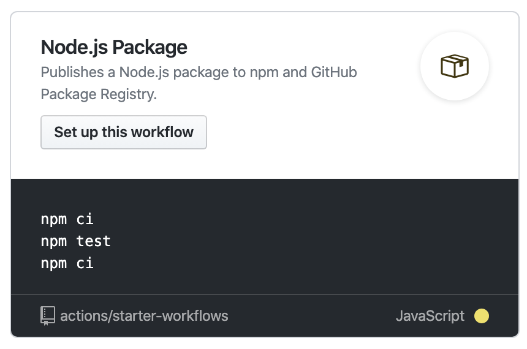
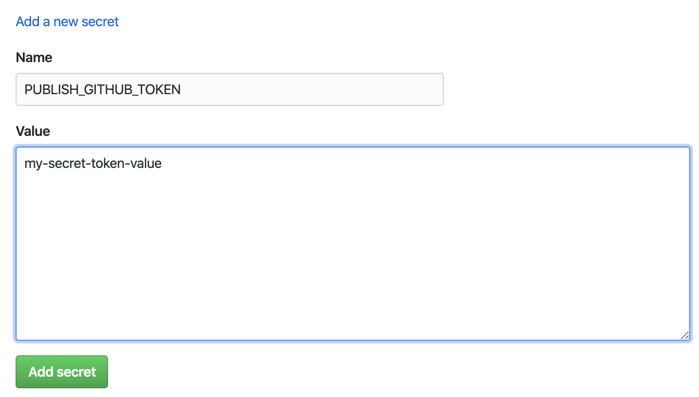

[GitHub Package Registry](https://help.github.com/en/github/managing-packages-with-github-packages/about-github-packages) recently went GA. There is pretty good documentation for how to use it, but it involves changing your `package.json` and/or `.npmrc` in your project to explicitly specify GitHub's registry. This means you lose the ability to publish to the npm registry. In my case, I wanted to publish my package to both registries.

One note before starting: The GitHub registry *only* supports scoped packages. So if your npm package currently has a name of `my-package`, you will have to rename it to `@username/my-package`, or else GitHub will reject your package. This is easy enough to do, but you will need to redirect users of your package to the new package name. This is easily done with the `npm deprecate` command:

    npm deprecate my-package "This package has moved, please install @username/my-package"

This will add a warning message when someone installs your package under the old name, and will also add a prominent message on your package's page on the npm website showing your deprecation message.

## GitHub Actions

To publish to both registries, we will use [GitHub Actions](https://github.com/features/actions). They actually have a workflow for accomplishing this task, but it requires a few tweaks in order to work properly.

To get started, go to your repository page on GitHub, and click the "Actions" tab. It will show you some starter workflows. One of the workflows displayed should be "Node.js Package". This is the one we'll use. Click "Set up this workflow".



This will open an editor showing some YAML code. This is the configuration for the job. This will get us mostly there, but when I set this up there were a few things I had to change.

There are three sections to this workflow. The first is to build the project. The second is to publish to npm, and the third is to publish to GitHub Package Registry (GPR).

## Secrets

First there's secrets. You will need authentication tokens for npm and GitHub to publish via this workflow. We will fill these in later. For now, you will notice two `NODE_AUTH_TOKEN` environment variables defined, one in the npm section and one in the GPR section. 

### GitHub token

In the `publish-gpr` section there should be a variable like this:

    NODE_AUTH_TOKEN: ${{secrets.GITHUB_TOKEN}}

When I set this up, GitHub would throw an error if I tried to define a secret starting with the string `GITHUB`. So let's change this to something like `PUBLISH_GITHUB_TOKEN`:

    NODE_AUTH_TOKEN: ${{secrets.PUBLISH_GITHUB_TOKEN}}

#### Generate token

Next we need to create a token and register it as a secret. A token is created under your [GitHub account settings](https://github.com/settings/tokens). Click "Generate new token".

Add a note for this token, like "GPR publishing token".

Under "Select scopes", select the following scopes:

- write:packages
- read:packages
- delete:packages

Then click the green "Generate token" button. Note that this is the only time the token will be displayed to you, so make sure to copy it to your clipboard for use in the next step.

#### Define secret

Next, go back to your repository page and go to the Settings page. There should be a "Secrets" tab. Click "Add a new secret".

Under "Name", enter `PUBLISH_GITHUB_TOKEN`. Then paste the token you copied before into the "Value" field.



### npm token

Now we'll set up the npm publishing token. In the `publish-npm` section of the workflow file, there is a variable like this:

    NODE_AUTH_TOKEN: ${{secrets.npm_token}}

I like consistency, so I renamed this to be `PUBLISH_NPM_TOKEN`, like this:

    NODE_AUTH_TOKEN: ${{secrets.PUBLISH_NPM_TOKEN}}

However, this is just my personal preference and is not at all required. If you want to leave it as `npm_token`, just remember to use that name when defining the secret later.

#### Generate token

To generate an npm token, log in to your account at [npmjs.com](https://npmjs.com). Click your user icon in the upper right corner of the page and then click "Tokens".

On the next screen, click the "Create New Token" button. For Access Level, select Read and Publish, then click "Create Token".

The token will be generated and displayed to you. Like with the GitHub token, this is the only time the token will be visible, so be sure to copy it to your clipboard now. If you lose the token after closing this page, you will need to generate a new one.

#### Define secret

Follow the steps above to define the `PUBLISH_NPM_TOKEN` secret in your repository settings.

## Workflow changes

At this point, our tokens are set up, we just have to make a few small changes to the workflow YAML file.

### `publish-npm` section

As mentioned earlier in this post, in order for your package to be published to GPR, it must be a scoped package (e.g. `@username/package-name`). GitHub will reject your package if it is not. 

As of the time of this writing, a scoped package is published as a private package by default for npm. This is probably not what you want, and in fact, if you have a free account, npm will reject the publish because publishing a private package requires a paid account.

Anyway, here's what the `publish-npm` section of the workflow should look like:

```yaml
publish-npm:
  needs: build
  runs-on: ubuntu-latest
  steps:
    - uses: actions/checkout@v1
    - uses: actions/setup-node@v1
      with:
        node-version: 12
        registry-url: https://registry.npmjs.org/
    - run: npm ci
    - run: npm publish
      env:
        NODE_AUTH_TOKEN: ${{secrets.PUBLISH_NPM_TOKEN}}
```

This will almost work, it just requires one line to be changed. The publish command should be changed to the following:

    - run: npm publish --access public

This will tell npm to publish your scoped package with public access.

That's all that's needed for npm publishing. Now let's fix the GPR publishing.

### `publish-gpr` section

The `publish-gpr` section should look something like this:

```yaml
publish-gpr:
  needs: build
  runs-on: ubuntu-latest
  steps:
    - uses: actions/checkout@v1
    - uses: actions/setup-node@v1
      with:
        node-version: 12
        registry-url: https://npm.pkg.github.com/
        scope: '@your-github-username'
    - run: npm ci
    - run: npm publish
      env:
        NODE_AUTH_TOKEN: ${{secrets.PUBLISH_GITHUB_TOKEN}}
```

First, you need to set your username in the `scope` argument. On this line, change `'@your-github-username'` to your actual GitHub username, prefixed with a `@` character, e.g. `'@joeattardi'`.

As you can see, it specifies the GPR package registry URL, which looks good. However, when I set this up, it didn't seem to honor that `registry-url` setting, and instead still tried to publish to the npm registry instead.

Luckily, there is an easy (if somewhat hackish) fix to this. We need to create a temporary entry in the `.npmrc` file to specify the registry. This will be done on a temporary basis on the build machine only and won't be committed back to your repository. Just before the publish command, add the following line:

    - run: echo registry=https://npm.pkg.github.com/YOUR_USERNAME >> .npmrc

That does it for the workflow changes. To recap, the workflow file should now look something like this:

```yaml
name: Node.js Package

on:
  release:
    types: [created]

jobs:
  build:
    runs-on: ubuntu-latest
    steps:
      - uses: actions/checkout@v1
      - uses: actions/setup-node@v1
        with:
          node-version: 12
      - run: npm ci
      - run: npm run build
      - run: npm run lint
      - run: npm test

  publish-npm:
    needs: build
    runs-on: ubuntu-latest
    steps:
      - uses: actions/checkout@v1
      - uses: actions/setup-node@v1
        with:
          node-version: 12
          registry-url: https://registry.npmjs.org/
      - run: npm ci
      - run: npm publish --access public
        env:
          NODE_AUTH_TOKEN: ${{secrets.PUBLISH_NPM_TOKEN}}

  publish-gpr:
    needs: build
    runs-on: ubuntu-latest
    steps:
      - uses: actions/checkout@v1
      - uses: actions/setup-node@v1
        with:
          node-version: 12
          registry-url: https://npm.pkg.github.com/
          scope: '@YOUR_USERNAME'
      - run: npm ci
      - run: echo registry=https://npm.pkg.github.com/YOUR_USERNAME >> .npmrc
      - run: npm publish
        env:
          NODE_AUTH_TOKEN: ${{secrets.PUBLISH_GITHUB_TOKEN}}
```

Commit this file, and your workflow should be set up.

## How to run the publish workflow

The workflow is configured to run any time you create a new release. Here's what I typically do:

After making the last of the changes for the new release, I update `package.json` with the new version number and commit it. I then create a tag with that version number, for example:

    git tag 2.0.1

Then I push this tag:

    git push origin 2.0.1

This will draft a new release in the repository, but it won't run the workflow yet. Go to your GitHub repository page and navigate to the releases section. You'll see the tag you just pushed at the top of the list.

Click on the tag, then click the "Edit tag" button. Enter some details about the release, then click the green "Publish release" button. Once the release is published, the package publishing workflow should begin. To verify this, go to the "Actions" tab of your repository. You should see the "Node.js Package" workflow running.

That's it! You should now be publishing to both the npm and GitHub registries whenever you create a new release.