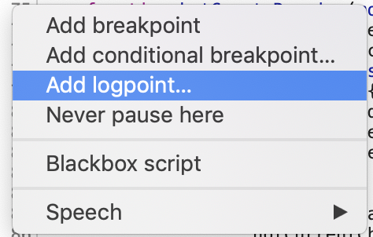
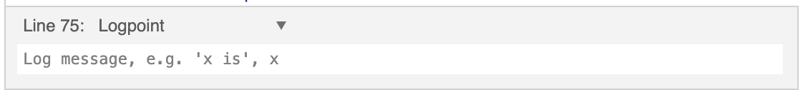

There is some negative sentiment out there about using `console.log` for debugging. It's true that, in
many cases, the browser's debugger is more powerful. However, there are still scenarios where using
`console.log` can be very useful.

Recently I was debugging a drag and drop issue. Some of my drop zones were not accepting drag overs or drops.
Using breakpoints in the debugger would not really have worked here. I wanted to see debug information as I was
dragging something. Imagine hitting a breakpoint on every `dragenter` or `dragover` event. It's not practical. 
The breakpoint would be triggered every time I move the mouse. I'd have to click the resume button, in which
case I'd probably lose my active drag operation, or press the resume hotkey one-handed (remember, I am holding down
the left mouse button with my finger on one hand).

Instead I added some `console.log` statements to print information about the element being dragged over, whether it
was a valid drop zone, etc. This produced a lot of log messages, but I still think it's easier than having execution
paused every time I move the mouse.

`console.log` can be even more handy when using logpoints in third party code.

## Logpoints: dynamically adding `console.log`s, even in third party code

Logpoints are a relatively new feature in Chrome and Firefox. They work similarly to breakpoints - you add them to a line of
code. Except instead of pausing execution, they will simply log out some information. You can put logpoints anywhere, not just
your own code. If you can see the code in the Sources panel, you can add a logpoint.

I haven't used logpoints in Firefox yet, but adding them in Chrome is simple. Open the code you want to add a logpoint to, and 
right-click on the line number. Select "Add logpoint...":

Then a box will appear where you can type the expression to log. This expression is formatted just like what you would pass to
a call to `console.log`. You can log multiple values by separating them with a comma.

Now, whenever that line of code is hit, the configured log message will be printed out.

## One last note

While `console.log` statements can be very useful with development and debugging, you should take them out before going to production.

Too many log messages can give curious users insight into the inner workings of the application. Errors should be displayed to the user in 
the application's UI, not logged to the console.

An additional consideration: if there are lots of logging statements being executed, this can affect the performance of the application.

## Further reading

- [10 Tips for Javascript Debugging Like a PRO with Console](https://medium.com/appsflyer/10-tips-for-javascript-debugging-like-a-pro-with-console-7140027eb5f6)
- [Chrome Logpoints](https://developers.google.com/web/updates/2019/01/devtools#logpoints)
- [Firefox Logpoints](https://developer.mozilla.org/en-US/docs/Tools/Debugger/Set_a_logpoint)
