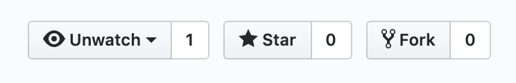

This is what most of my GitHub repositories look like:

A few of my projects have a dozen or so stars, but my work is largely unknown. My most popular project, [json-colorizer](https://www.npmjs.com/package/json-colorizer), has (as of the time this post was written) about 4,000 downloads a week. I use the term "popular" very loosely because for an npm package, this is not very popular. Only 35 packages list it as a dependency (one of which is another of my projects).

This is fine. I [learned a lot in the process of creating it](/create-a-basic-lexer). If a handful people find it useful, that's great, but it's not my primary goal.

For me, the primary goal of a side project is to learn something, or to practice something I already know. The reason I created `json-colorizer` was because I had created another project, simply named [http-tool](https://www.npmjs.com/package/http-tool), to play around with Node's APIs for making HTTP requests. I wanted to colorize the JSON response body of requests, so I decided to create the colorizer as a separate library. At the time, I wasn't aware of the [jsome](https://www.npmjs.com/package/jsome) project, which does the same thing as `json-colorizer` but is a lot more popular (around 70,000 weekly downloads).

Another project, [GitHub PR Dashboard](https://github.com/joeattardi/github-pr-dashboard), was created out of a need to see GitHub pull requests across multiple repositories, something we had at Constant Contact. At the time, I was just starting to learn React, so I decided to build a pull request dashboard using React. I ended up also using Redux in that project - probably overkill - but I learned a ton, and it was fun. Later, I started working on an [Angular version](https://github.com/joeattardi/github-pr-dashboard-angular), which I never got around to finishing. Which brings me to my next point...

# You don't need to finish it to get something out of it

Most of my projects on GitHub are half-finished or less. Here are a few:

 - The aforementioned Angular version of GitHub PR Dashboard
 - [GeekChat](https://github.com/joeattardi/geek-chat), an attempt to make a multi-room chat app. This was mostly a project for learning Vue.js (which, alas, I have all but forgotten by now).
 - [Shout](https://github.com/joeattardi/shout), another attempt at a chat app, built in Angular. 
 - [API Client](https://github.com/joeattardi/api-client), a poor man's [Postman](https://www.getpostman.com/) clone, an experiment working with Electron and React.

 You get the point. I have a lot of unfinished projects. Sometimes, I just didn't have the time; other times, I got distracted and started something new. I think this is OK, because I learned a lot while working on each of these projects.

 Of course, it is always better if you do finish it. It feels good to finish it and put it out there. But my point is that even if you don't, you can still get a lot out of it.

 Now, go off and build something!
 